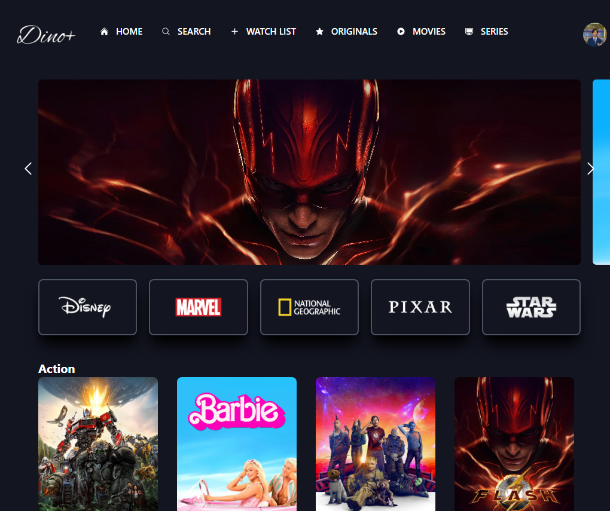

# Dino Plus Movie

Dino Plus Movie is a web application built using React, Tailwind CSS, and Vite. The project aims to provide a user-friendly and visually appealing interface for movie enthusiasts.



## Installation

To run the Dino Plus Movie project on your local machine, follow these steps:

1. Ensure you have [Node.js](https://nodejs.org) installed on your system.
2. Clone the repository:

   ```bash
   git clone https://github.com/bzizmza/dino-plus-movie.git
   ```

3. Navigate to the project directory:

   ```bash
   cd dino-plus-movie
   ```

4. Install the dependencies:

   ```bash
   npm install
   ```

5. Start the development server:

   ```bash
   npm run dev
   ```

6. Open your browser and visit `http://localhost:3000` to see the application.

## Project Structure

The project structure is organized as follows:

```
dino-plus-movie/
  ├── public/                  # Static assets
  ├── src/                     # Application source code
  │   ├── components/          # Reusable React components
  │   ├── pages/               # Individual page components
  │   ├── services/            # API services and data fetching
  │   ├── styles/              # Global styles and Tailwind CSS configuration
  │   └── utils/               # Utility functions
  ├── .gitignore               # Git ignore file
  ├── package.json             # Node.js dependencies and scripts
  ├── README.md                # Project documentation (you are here!)
  └── vite.config.js           # Vite configuration
```

## Configuration

The project uses Vite for fast and optimized development. The configuration can be found in the `vite.config.js` file, where you can modify the build options, plugins, and other settings according to your requirements.

## Dependencies

The main dependencies used in this project are:

- React: A JavaScript library for building user interfaces.
- Tailwind CSS: A utility-first CSS framework for rapidly building custom user interfaces.
- Vite: A build tool that provides fast and optimized development setup for modern web projects.
- [The Movie Database (TMDb) API](https://www.themoviedb.org/documentation/api): An API that provides movie and TV show data.

For a complete list of dependencies, refer to the `package.json` file.

## Contributing

Contributions to the Dino Plus Movie project are welcome! If you find any bugs, have feature requests, or want to contribute code improvements, feel free to open issues or submit pull requests on the project's GitHub repository.

Before contributing, please review the [contribution guidelines](CONTRIBUTING.md).

## License

The Dino Plus Movie project is released under the [MIT License](LICENSE.md). Feel free to use, modify, and distribute the code as per the terms of the license.

## Acknowledgments

- The Dino Plus Movie project was inspired by the love for movies and the desire to create an engaging platform for movie enthusiasts.
- Thanks to the creators and maintainers of React, Tailwind CSS, and Vite for their amazing tools and frameworks.

## Contact

For any questions or inquiries, you can reach out to the project maintainer:

- Name: Bima Setyo
- Email: bima030201@gmail.com
- GitHub: [bzizmza](https://github.com/bzizmza)

We hope you enjoy using Dino Plus Movie! Happy movie exploration! 🎬🍿

## API Usage

Dino Plus Movie also utilizes the API from [The Movie Database (TMDb)](https://www.themoviedb.org/documentation/api) to fetch movie data, including details, ratings, and reviews. Please refer to the TMDb API documentation for more information on how to obtain an API key and use it in your project.
